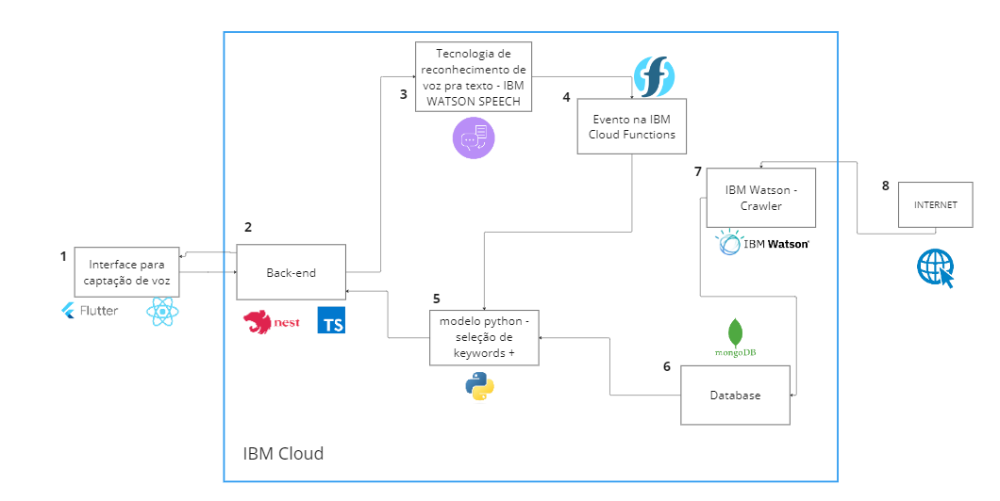

# ponderada-sem9

# Fomentando o Aprendizado Contínuo em Sistemas Conversacionais

## Introdução

Trabalhos recentes mostraram que Modelos de Linguagem, como T5 (Raffel et al., 2019) e GPT-3 (Brown et al., 2020), tem a capacidade de armazenar uma quantidade tremenda do conhecimento do mundo nos seus parâmetros quando pré-treinados em um grande corpo de texto (Petroni et al., 2019). Esses modelos pré-treinados mostraram potencial para servir como bases de conhecimento quando sondados para conhecimento do mundo sem nenhum ajuste fino através da tarefa "Language Model Analysis (LAMA)", que requer sondar Modelos de Linguagem para o conhecimento da humanidade, de uma maneira zero-shot (informações que não foram vistas no treino), através de preenchimento de slots, e resultados promissores utilizando o conhecimento do mundo codificado, quando refinados em vários "Knowledge Intensive Language Tasks" (KILT) (Petroni et al., 2021). 

Embora o conhecimento do mundo armazenado nos Modelos de Linguagem tenha diversos casos de uso, ele pode rapidamente ficar desatualizado à medida que o mundo evolui, e os modelos de linguagem precisam renovar frequentemente de acordo com a evolução da sociedade. Por exemplo, é impossível sondar por novas informações como "quem ganhou a eleição dos EUA 2020" do T5 original (Raffel et al., 2019), que foi pré-treinado com o corpo da web C4 de abril de 2019. Nesses casos é percetível a não utilização do Concept Drift, que é um fenômeno em que o modelo está sempre aprendendo e se aprimorando. 

## Solução Proposta

A solução proposta é a utilização de um modelo de aprendizado contínuo, ou seja, um modelo que aprende e se aprimora com o tempo. Para que isso aconteça, algumas coisas precisam ser analisadas e adicionadas ao modelo.

<strong> Novo corpo de texto para o Modelo de Linguagem</strong> - Para Modelos de Linguagem renovarem seu conhecimento interno, eles precisam ser continuamente treinados com um novo corpo de texto. Idealmente o texto adicional deve ser muito menor do que o texto original, pois um texto grande resultará em custos computacionais massivos semelhantes ao pré-treinamento dos Modelos de Linguagem do zero. Para construir o novo corpo de texto, é necessário rastrear artigos de notícias recentemente publicados na web. Os textos ficam armazenados no banco de dados (bloco 6) representado no diagrama de blocos. A busca deve ser feita com o IBM Watson - Crawler (bloco 7), que é um serviço de busca de conteúdo na web. 

<strong> Sondagem de modelos para conhecimento </strong> - A tarefa mais utilizada para fazer sondagem é o "LAnguage Model Analysis" (LAMA) (Petroni et al., 2019), que consiste em frases de preenchimento de slots criadas a partir de um conjunto de fontes de conhecimento usando modelos definidos manualmente. Definimos que um modelo de linguagem conhece um fato se ele puder prever com sucesso, de maneira zero-shot, a entidade mascarada na frase de preenchimento de slots. Enquanto existem outras alternativas para medir o conhecimento mundano, construímos nossos principais conjuntos de dados como tarefas LAMA, enquanto também fornecemos os pares de perguntas correspondentes às frases de preenchimento de slots para aqueles que desejam testar no CBQA também. O bloco de sondagem de modelos não está representado no diagrama de blocos, pois ele é externo à arquitetura do projeto. 

### Diagrama de Blocos

## Conclusão

A partir do que foi citado, podemos concluir que o aprendizado contínuo é uma técnica que pode ser utilizada para melhorar o desempenho de modelos de linguagem, pois permite que o modelo aprenda e se aprimore com o tempo. O esforço para implementar a solução é grande em um projeto que não foi pensado para isso, mas depois de implementado, o modelo pode ser utilizado e reaproveitado para várias finalidades. 

## Referências Bibliográficas

1. JANG, Joel et al. Towards continual knowledge learning of language models. arXiv preprint arXiv:2110.03215, 2021.